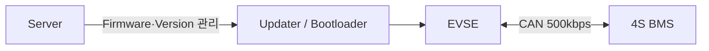
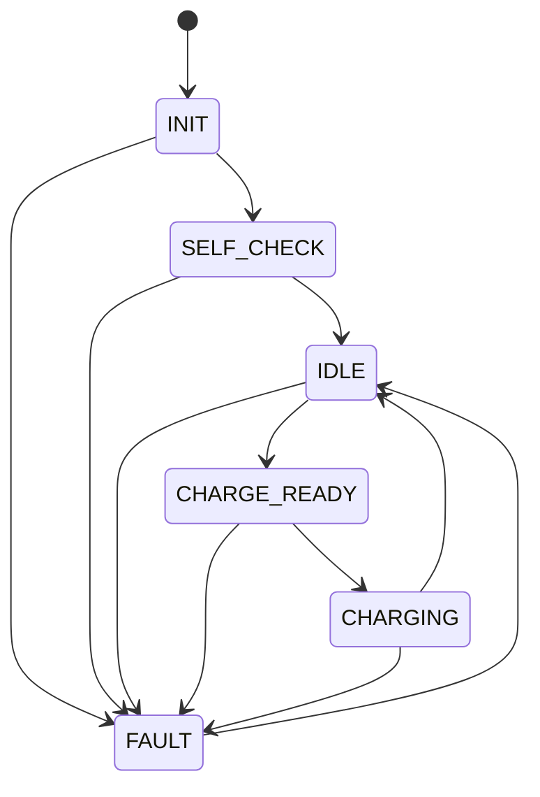

# 🔋 Embedded Device Lifecycle Platform

서버·Updater·Bootloader를 통한 EVSE 펌웨어 배포·업데이트 기능과 EVSE·BMS 간 CAN 통신 기반의 충전 제어 기능을 결합한 **임베디드 장치 관리 플랫폼**입니다.

서버와 Updater·Bootloader는 EVSE 펌웨어의 생애주기를 관리합니다. EVSE와 BMS는 CAN을 통해 충전 요청과 배터리 상태·충전 허가 정보를 교환하며, 안전 조건이 충족될 때 배터리 충전을 수행합니다.

본 프로젝트에서 저는 **STM32F446RE 기반 4S BMS 하드웨어 및 펌웨어**를 담당했습니다. BMS는 배터리의 셀 전압·팩 전압·전류·온도를 주기적으로 측정하고, Fault와 통신 상태를 독립적으로 검증해 안전한 경우에만 EVSE에 충전을 허가합니다.

> 현재 BMS 펌웨어는 OTA를 지원하지 않습니다.
> CAN `0x203`으로 BMS OTA 진입 요청을 수신하면 `Not Supported` 응답을 반환합니다.

| 항목      | 내용                                 |
| ------- | ---------------------------------- |
| 전체 구성   | Server · Bootloader · EVSE · BMS   |
| 담당 파트   | STM32F446RE 기반 4S BMS 하드웨어·펌웨어     |
| 주요 기능   | 배터리 계측 · Fault 판단 · 충전 허가 · 릴레이 제어 |
| 통신 방식   | EVSE ↔ BMS CAN 500kbps             |
| 제어 방식   | 6상태 FSM + De-energize Fail-safe    |
| 실행 환경   | Bare-metal Super Loop              |
| 개발 기간   | 2026.08.04 ~ 2026.08.27            |
| 프로젝트 형태 | Team Project                       |

---

## 📂 Contents

* [👨‍💻 담당 역할](#-담당-역할)
* [🌳 개발 환경](#-개발-환경)
* [🧩 System Architecture](#-system-architecture)
* [📁 BMS Software Architecture](#-bms-software-architecture)
* [⏱️ 주기 기반 스케줄러](#️-주기-기반-스케줄러)
* [📏 배터리 계측](#-배터리-계측)
* [⚙️ FSM 기반 충전 제어](#️-fsm-기반-충전-제어)
* [🛡️ Fault 및 안전 설계](#️-fault-및-안전-설계)
* [📡 EVSE–BMS CAN 통신](#-evsebms-can-통신)
* [🔌 릴레이 Fail-safe 제어](#-릴레이-fail-safe-제어)
* [🖥️ OLED·LED 상태 표시](#️-oledled-상태-표시)
* [🔧 통신 및 주변장치 안정화](#-통신-및-주변장치-안정화)
* [🧪 동작 검증](#-동작-검증)
* [🛠️ 트러블슈팅](#️-트러블슈팅)
* [📚 주요 소스 파일](#-주요-소스-파일)

---

## 👨‍💻 담당 역할

| 구분       | 담당 내용                                     |
| -------- | ----------------------------------------- |
| BMS 하드웨어 | 4S 배터리 전압·전류·온도 계측 회로 구성                  |
| BMS 펌웨어  | 주기 스케줄러, Fault 판단, FSM, SOC, 릴레이 제어       |
| 전압 계측    | ADC DMA 기반 누적 노드 전압 측정 및 셀별 전압 계산         |
| 전류 계측    | INA226·ACS712 이중 전류 계측 및 보호 전류 선택         |
| 온도 계측    | NTC 4채널 측정 및 최고 온도 기반 보호                  |
| 보호 로직    | 셀 과전압·저전압, 팩 과전압·과전류, 과온, 센서 이상 보호        |
| CAN 통신   | EVSE 명령 수신 및 BMS 상태·측정값·응답 송신             |
| 충전 제어    | `charge_permit` 생성 및 PB5 릴레이 Fail-safe 제어 |
| 상태 표시    | OLED 측정값·상태 표시, 3색 LED 상태 구분              |
| 시스템 통합   | EVSE–BMS CAN 연동 및 충전 시퀀스 검증               |

---

## 🌳 개발 환경

| 구분       | 내용                                       |
| -------- | ---------------------------------------- |
| MCU      | STM32F446RE                              |
| IDE      | STM32CubeIDE / STM32CubeMX               |
| Language | C                                        |
| 실행 구조    | Bare-metal Super Loop + Tick 기반 주기 스케줄러  |
| 통신       | CAN 500kbps · I2C · UART                 |
| 주요 주변장치  | ADC DMA · GPIO · CAN · I2C · UART · Tick |
| 전압 계측    | 분압 회로 + ADC 4채널                          |
| 전류 계측    | INA226 + ACS712                          |
| 온도 계측    | NTC Thermistor 4채널                       |
| 출력 장치    | PB5 BMS Relay · OLED · 3색 LED            |
| 배터리      | 4S Battery Pack + 4S Protection Board    |

RTOS를 사용하지 않고 각 기능의 실행 주기를 분리한 Super Loop 구조로 구현했습니다. 센서 처리나 화면 출력이 안전 제어 루프를 지연시키지 않도록 작업별 실행 시점을 나눴습니다.

---

## 🧩 System Architecture

### 전체 플랫폼 구조



서버·Updater·Bootloader는 EVSE 펌웨어의 배포와 업데이트를 담당하며, EVSE는 서버와 연동해 펌웨어를 관리하고 충전 요청 및 전원 경로를 제어합니다.

BMS는 EVSE와 CAN 통신으로 연결되어 배터리의 전압·전류·온도를 측정하고 안전 상태를 판단합니다. 판단 결과인 충전 허가(charge_permit)를 EVSE에 전달하며, EVSE와 BMS의 조건이 모두 충족될 때 배터리 충전을 수행합니다.

### 충전 전력 경로

```text
12V Adapter
    → LTC3780 승압 모듈
    → EVSE Relay
    → INA226
    → ACS712
    → BMS Relay
    → 4S Protection Board
    → 4S Battery Pack
```

### BMS 제어 흐름

```text
센서 계측
    → 측정값 보정 및 유효성 확인
    → Fault·Warning 판단
    → FSM 상태 갱신
    → charge_permit 생성
    → BMS Relay 제어
    → CAN·OLED·LED 상태 출력
```

### 설계 의도

* **EVSE의 충전 요청을 그대로 실행하지 않음**
  EVSE에서 충전 시작 요청이 들어오더라도 BMS가 배터리와 통신 상태를 다시 확인합니다.

* **요청과 허가를 분리**
  EVSE의 `charge_req`와 BMS의 `charge_permit`이 모두 유효해야 충전 가능한 FSM 상태로 진입합니다.

* **통신 이상도 보호 조건에 포함**
  배터리 측정값이 정상이더라도 CAN 연결이 끊기면 이전 충전 요청을 폐기하고 충전을 중단합니다.

* **전원·통신·센서 이상 시 안전 상태로 수렴**
  유효한 ON 조건을 유지할 수 없으면 PB5의 Normally Open 릴레이가 개방 상태로 돌아가도록 설계했습니다.

---

## 📁 BMS Software Architecture

BMS 코드는 역할에 따라 `app`, `dev`, `hw`, `common` 계층으로 구분했습니다.

```text
BMS/
├── app/
│   ├── bms_app.c          # 주기 스케줄러 및 BMS 전체 실행 흐름
│   ├── bms_can.c          # CAN 수신·송신·응답 처리
│   ├── bms_state.c        # 6상태 FSM 및 충전 상태 전이
│   ├── bms_fault.c        # Fault·Warning 판단 및 복구
│   └── bms_ui.c           # OLED·LED 상태 표시
│
├── common/
│   ├── bms_cfg.h          # CAN ID, 보호 기준 및 설정값
│   └── bms_types.h        # 상태, Fault, 데이터 구조 정의
│
├── dev/
│   ├── Cell ADC
│   ├── INA226
│   ├── ACS712
│   ├── NTC
│   ├── OLED
│   └── LED
│
└── hw/
    ├── ADC
    ├── I2C
    ├── GPIO
    ├── UART
    └── Tick
```

| 계층       | 역할                                 |
| -------- | ---------------------------------- |
| `app`    | BMS 제어 흐름, Fault, FSM, CAN, UI 구현  |
| `common` | CAN ID, 보호 설정값, 공통 자료형 정의          |
| `dev`    | 센서와 출력 장치를 기능 단위로 추상화              |
| `hw`     | ADC, I2C, GPIO, UART, Tick 하드웨어 접근 |

CAN 전용 `hw` 래퍼는 사용하지 않습니다. `[bms_can.c](BMS/app/bms_can.c)`가 CubeMX에서 생성된 `hcan1`과 STM32 HAL CAN API를 직접 사용합니다.

---

## ⏱️ 주기 기반 스케줄러

`[bms_app.c](BMS/app/bms_app.c)`에서 Tick을 기준으로 100ms, 500ms, 1000ms 작업을 구분했습니다.

| 실행 주기  | 수행 기능                                                       |
| ------ | ----------------------------------------------------------- |
| 100ms  | 셀 ADC, INA226, ACS712, Fault, FSM, Relay, CAN `0x100/0x103` |
| 500ms  | NTC, OLED, CAN `0x101/0x102`                                |
| 1000ms | SOC, 버전, 콘솔 출력, CAN 통계                                      |

### 100ms 안전 제어 흐름

```text
Cell ADC
    → INA226 / ACS712
    → Fault Check
    → FSM Update
    → Relay Control
    → CAN 0x100 / 0x103
```

센서 계측 이후 Fault를 먼저 판단하고, 그 결과를 FSM과 릴레이 제어에 반영합니다. 릴레이를 먼저 제어한 뒤 Fault를 확인하면서 발생할 수 있는 한 주기 지연을 방지했습니다.

### 500ms 상태 갱신

```text
NTC 측정
    → 최고 온도 갱신
    → OLED 화면 갱신
    → CAN 0x101 / 0x102
```

온도와 화면 표시는 500ms마다 갱신해 100ms 안전 제어 루프의 실행 시간을 침범하지 않도록 했습니다.

### 1000ms 진단 작업

```text
SOC 계산
    → 버전 정보 갱신
    → 콘솔 상태 출력
    → CAN 통계 출력
```

주기가 길어도 되는 진단·표시 기능은 1000ms 작업으로 분리했습니다.

---

## 📏 배터리 계측

### ① ADC DMA 16회 오버샘플링

셀 전압은 ADC DMA를 이용해 각 채널을 반복 측정하고, **16개 샘플의 평균값**을 사용합니다.

한 번의 ADC 값으로 전압을 결정하지 않고 여러 샘플을 평균내 순간 노이즈의 영향을 줄였습니다.

```text
ADC DMA 수집
    → 채널별 16개 Sample 누적
    → 평균 ADC 값 계산
    → VDDA 보정
    → 실제 누적 전압 변환
```

### ② VREFINT 기반 VDDA 보정

ADC 변환 시 기준전압을 항상 고정된 3.3V로 가정하지 않고, STM32 내부 기준전압인 `VREFINT`를 이용해 실제 VDDA를 계산합니다.

전원전압이 조금 변하더라도 보정된 VDDA를 ADC 환산에 적용해 셀 전압 계산 오차를 줄였습니다. 계산된 VDDA는 OLED에도 표시해 ADC 기준전압 상태를 확인할 수 있도록 했습니다.

### ③ 4S 셀 전압 산출

4개의 ADC 채널은 각 셀의 개별 전압이 아니라 배터리 음극을 기준으로 한 **누적 노드 전압**을 측정합니다.

```text
P1 = Cell 1까지의 누적 전압
P2 = Cell 1 + Cell 2 누적 전압
P3 = Cell 1 + Cell 2 + Cell 3 누적 전압
P4 = 전체 4S Pack 전압
```

각 셀의 전압은 인접한 누적 노드의 차로 계산합니다.

```text
Cell 1 = P1
Cell 2 = P2 - P1
Cell 3 = P3 - P2
Cell 4 = P4 - P3

Pack Voltage = P4
```

누적 노드 방식은 하나의 접점이 불안정하면 이후 셀 계산값도 함께 틀어질 수 있습니다. 따라서 셀별 결과뿐 아니라 P1~P4 원시 누적 전압의 범위와 순서도 함께 확인합니다.

### ④ INA226·ACS712 이중 전류 계측

팩 전류는 INA226과 ACS712 두 센서로 측정합니다.

| 센서     | 계측 방식              | 역할                  |
| ------ | ------------------ | ------------------- |
| INA226 | 션트 저항 전압을 I2C로 측정  | 정상 범위의 주 전류 계측      |
| ACS712 | 홀 효과 기반 아날로그 출력 측정 | 보조 전류 계측 및 보호 경로 대체 |

평상시에는 INA226 값을 대표 전류로 사용합니다. INA226가 측정 가능한 범위를 벗어나 포화된 경우에는 보호 판단에 사용할 전류를 ACS712 값으로 전환합니다.

```text
INA226 정상
    → INA226 전류 사용

INA226 포화 또는 유효하지 않음
    → ACS712 전류로 보호 경로 전환
```

INA226의 측정 범위를 넘는 전류가 들어왔을 때 값이 더 이상 증가하지 않는 문제를 보조 센서로 보완했습니다.

### ⑤ NTC 4채널 온도 계측

배터리 각 셀 주변에 NTC 4채널을 배치했습니다.

보호 판단에는 평균 온도가 아니라 **4개 채널 중 가장 높은 온도**를 사용합니다. 특정 셀만 빠르게 가열되는 상황이 평균값에 가려지지 않도록 하기 위한 설계입니다.

```text
NTC 1~4 측정
    → 각 채널 온도 변환
    → 최대 온도 선택
    → 과온 Fault 판단
```

### ⑥ 셀 편차 및 SOC

최대 셀 전압과 최소 셀 전압의 차이를 계산해 셀 편차를 확인합니다.

셀 불균형은 즉시 충전을 차단하는 Critical Fault가 아니라 Warning으로 분리했습니다. SOC는 별도 주기로 계산해 OLED와 CAN을 통해 전달합니다.

---

## ⚙️ FSM 기반 충전 제어

충전 동작은 단순 ON/OFF 조건문이 아니라 6개의 상태로 관리합니다.



| 상태             | 역할                             |
| -------------- | ------------------------------ |
| `INIT`         | BMS 주변장치와 내부 변수 초기화, Relay OFF |
| `SELF_CHECK`   | 센서와 초기 상태의 정상 여부 확인            |
| `IDLE`         | 충전 요청 대기, Relay OFF            |
| `CHARGE_READY` | EVSE 요청과 BMS 안전 조건 최종 확인       |
| `CHARGING`     | 유효한 조건이 유지되는 동안 충전 수행          |
| `FAULT`        | 충전 허가 제거 및 Relay OFF 유지        |

`CHARGE_READY` 진입 과정에서는 다음 조건을 확인합니다.

```text
charge_permit
&& link_ok
&& charge_req
&& connected
&& !e_stop
```

Critical Fault는 어느 상태에서든 `FAULT` 진입을 우선시합니다. Fault가 해제된 후에는 바로 충전을 재개하지 않고 `IDLE`로 복귀해 새로운 EVSE 요청과 현재 안전 조건을 다시 확인합니다.

---

## 🛡️ Fault 및 안전 설계

### 주요 보호 항목

| 보호 항목       | 판단 내용                    | 제어 결과                 |
| ----------- | ------------------------ | --------------------- |
| 셀 과전압·저전압   | Cell 1~4 중 하나라도 허용 범위 이탈 | Critical Fault, 충전 차단 |
| 팩 과전압       | 전체 4S Pack 전압 한계 초과      | Critical Fault, 충전 차단 |
| 과전류         | 선택된 대표 전류가 설정 범위 초과      | Critical Fault, 충전 차단 |
| 과온          | NTC 4채널 중 최고 온도 한계 초과    | Critical Fault, 충전 차단 |
| 센서 이상       | 측정 실패, 포화 또는 유효 범위 이탈    | 보호 경로 전환 또는 Fault     |
| CAN Timeout | 일정 시간 동안 EVSE 메시지 미수신    | 요청 무효화, 충전 차단         |
| 셀 불균형       | 최대·최소 셀 전압 편차 초과         | Warning 표시            |

### Fault 3회 연속 확인

ADC와 센서값은 순간적인 노이즈로 한 번씩 임계값을 벗어날 수 있습니다. 측정 한 번만으로 Fault를 확정하면 정상 상태에서도 릴레이가 반복적으로 동작할 수 있습니다.

이를 방지하기 위해 100ms 주기의 이상 값을 3회 연속 확인합니다.

```text
이상 값 1회 → 확인 중
이상 값 2회 → 확인 중
이상 값 3회 → Fault 확정
```

이상 상태가 약 300ms 동안 지속되면 Fault로 확정하고, **Fault 확정 직후** `charge_permit`을 해제합니다.

### 비대칭 Fault 복구

Fault 진입과 해제에 동일한 단일 임계값을 사용하면 측정값이 경계 부근에서 움직일 때 Fault가 반복해서 설정·해제될 수 있습니다.

이를 방지하기 위해 진입과 해제 조건을 다르게 구성했습니다.

* Fault 진입: 이상 값 3회 연속 확인
* Fault 해제: 복구 임계값에 히스테리시스 적용
* 일반 Fault 해제: 정상 상태 3초 유지
* Fault 해제 후: `IDLE` 상태로 복귀
* 충전 재개: 새로운 요청과 모든 안전 조건 재검증

### Warning과 Critical Fault 분리

셀 편차를 나타내는 `IMBALANCE`는 Warning으로 구분합니다.

다음과 같이 모든 Fault bit를 충전 차단 조건으로 사용하지 않습니다.

```c
if (fault != 0)
{
    charge_permit = 0;
}
```

Warning까지 모두 충전 차단에 포함하면 실제 위험 상태가 아닌데도 충전이 중단될 수 있습니다.

따라서 `[bms_types.h](BMS/common/bms_types.h)`와 `[bms_fault.c](BMS/app/bms_fault.c)`에서 Warning과 Critical Fault를 분리하고, **Critical Fault만 `charge_permit`을 차단**하도록 구성했습니다.

---

## 📡 EVSE–BMS CAN 통신

EVSE와 BMS는 CAN 500kbps로 충전 요청, 장치 상태, Fault, 측정값과 제어 응답을 교환합니다.

### EVSE → BMS 수신 ID

| CAN ID  | 실제 용도                       |
| ------- | --------------------------- |
| `0x200` | EVSE 상태, 릴레이, 연결 상태, E-Stop |
| `0x201` | 충전 시작·중지 요청                 |
| `0x202` | EVSE Fault                  |
| `0x203` | BMS OTA 진입 요청 — 현재 미지원      |
| `0x205` | 보호 임계값 변경                   |

### BMS → EVSE 송신 ID

| CAN ID          | 용도                        |
| --------------- | ------------------------- |
| `0x100 ~ 0x105` | BMS 상태·측정값·Fault·명령 응답 전송 |

주기 송신 프레임은 다음과 같이 나눴습니다.

| 실행 주기  | CAN ID           |
| ------ | ---------------- |
| 100ms  | `0x100`, `0x103` |
| 500ms  | `0x101`, `0x102` |
| 명령·상황별 | 나머지 상태·응답 프레임    |

### 충전 요청 처리

EVSE의 충전 요청과 장치 상태는 서로 다른 CAN ID로 전달됩니다.

* `0x200`: EVSE 연결, 릴레이, E-Stop 등의 상태
* `0x201`: 충전 시작 또는 중지 명령
* `0x202`: EVSE 자체 Fault 정보

BMS는 각 프레임에서 필요한 정보를 갱신하고, FSM 전이 시 충전 요청·연결·E-Stop·Fault·CAN 링크 조건을 종합적으로 확인합니다.

### CAN DLC 검증

수신 프레임은 CAN ID만 확인하지 않고, 해당 ID에 정의된 DLC가 맞는지도 검사합니다.

```text
CAN ID 확인
    → 예상 DLC 확인
    → 데이터 범위 확인
    → 유효한 프레임만 상태에 반영
```

길이가 잘못된 프레임을 정상 명령으로 해석해 상태값이 잘못 갱신되는 것을 방지합니다.

### CAN Timeout과 Stale Request 제거

마지막 정상 CAN 수신 시각을 저장하고, 일정 시간 동안 새로운 메시지가 들어오지 않으면 링크가 끊긴 것으로 판단합니다.

```text
CAN 메시지 미수신
    → link_ok = 0
    → 이전 charge_req 제거
    → 충전 가능한 FSM 상태 이탈
    → charge_permit 해제
    → Relay OFF
```

통신이 복구된 후에도 이전 `charge_req`를 재사용하지 않습니다. 새로운 `0x201` 충전 요청을 수신해야 다시 충전 절차를 시작할 수 있습니다.

### BMS OTA 요청 처리

BMS는 `0x203`으로 OTA 진입 요청을 받을 수 있지만, 현재 BMS Bootloader와 OTA 적용 기능은 구현되어 있지 않습니다.

따라서 요청을 무시하거나 OTA가 가능한 것처럼 처리하지 않고, 명시적으로 `Not Supported` 응답을 반환합니다.

```text
EVSE → BMS : CAN 0x203 OTA 진입 요청
BMS → EVSE : Not Supported 응답
```

### CAN을 통한 보호 임계값 변경

EVSE는 `0x205`를 이용해 다음 보호 임계값의 변경을 요청할 수 있습니다.

* 셀 과전압 기준
* 과전류 기준
* 과온 기준

수신한 값을 그대로 적용하지 않고, 펌웨어에서 정의한 안전 범위 안에 있는 값만 사용하도록 제한합니다.

```text
0x205 수신
    → DLC 검증
    → 요청값 해석
    → 허용 가능한 안전 범위 확인
    → 유효한 설정만 적용
    → 처리 결과 응답
```

원격 명령으로 보호 기준이 과도하게 완화되는 것을 방지하기 위한 처리입니다.

---

## 🔌 릴레이 Fail-safe 제어

충전 경로는 세 단계로 보호합니다.

| 보호 계층   | 구성                  | 역할                      |
| ------- | ------------------- | ----------------------- |
| Layer 1 | 4S Protection Board | MCU와 독립적인 셀 단위 물리 보호    |
| Layer 2 | BMS Relay, PB5      | BMS 판단에 따른 충전 경로 차단     |
| Layer 3 | EVSE Relay          | BMS 충전 허가를 반영한 전원 경로 제어 |

BMS Relay에는 Normally Open 접점을 사용했습니다. MCU 초기화 전, BMS 전원 상실 또는 유효한 ON 출력이 없는 상황에서는 충전 경로가 개방됩니다.

### 릴레이 출력 함수의 직접 확인 조건

실제 릴레이 출력 단계에서는 다음 두 조건을 직접 확인합니다.

```text
charge_permit
&& (FSM == CHARGE_READY || FSM == CHARGING)
```

EVSE 요청, 연결 상태, E-Stop, CAN 링크 상태를 릴레이 함수에서 모두 다시 검사하는 구조는 아닙니다.

각 조건은 FSM 전이 과정에서 검증하며, 릴레이 출력 단계에서는 `charge_permit`과 현재 FSM이 충전 가능한 상태인지를 최종 확인합니다.

> 릴레이 출력 단계에서는 `charge_permit`과 FSM 상태를 다시 확인하며, EVSE 요청·연결·E-Stop·CAN 링크 조건은 FSM 전이 과정에서 검증합니다.

### 최종 충전 흐름

```text
EVSE 상태·요청 수신
    → 연결·E-Stop·CAN 링크 확인
    → BMS Critical Fault 확인
    → 충전 가능한 FSM 상태 진입
    → charge_permit 확인
    → PB5 Relay ON
```

Critical Fault가 발생하거나 충전 불가 상태로 전이하면 `charge_permit`이 해제되고 릴레이가 개방됩니다.

---

## 🖥️ OLED·LED 상태 표시

### OLED 표시 항목

OLED에는 다음 정보가 표시됩니다.

* 현재 FSM
* `charge_permit`
* BMS 릴레이 상태
* Cell 1~4 전압
* Pack 전압
* 선택된 대표 전류
* NTC 4채널 중 최고 온도
* SOC
* 셀 전압 편차
* 현재 Fault
* VDDA

INA226와 ACS712의 전류를 각각 별도 항목으로 표시하지 않습니다. INA226 정상 여부와 포화 상태를 반영해 선택된 **대표 전류**를 표시합니다.

CAN 링크 상태 역시 OLED의 독립 항목으로 표시하지 않고, Fault와 FSM 및 콘솔 로그를 통해 확인합니다.

### 3색 상태 LED

| 상태       | 표시 내용                   |
| -------- | ----------------------- |
| POWER    | BMS 전원 및 기본 동작 상태       |
| CHARGING | 충전 가능한 상태 및 릴레이 동작      |
| FAULT    | Critical Fault 또는 보호 상태 |

OLED는 상세 측정값을 확인하는 용도로 사용하고, LED는 현재 상태를 빠르게 구분하는 용도로 사용했습니다.

---

## 🔧 통신 및 주변장치 안정화

### ① CAN Bus-Off 자동 복구

CAN 통신 오류가 누적되어 Bus-Off 상태로 진입할 수 있으므로 STM32 CAN 설정에서 자동 복구 기능을 활성화했습니다.

```text
CAN 오류 누적
    → Error-Passive
    → Bus-Off
    → 자동 복구 절차
    → CAN 통신 재개
```

자동 복구와 별개로 BMS 제어 로직은 통신 단절 구간에서 `charge_req`를 제거하고 릴레이를 차단합니다. CAN 주변장치가 복구되더라도 충전은 새로운 요청을 받은 후에만 재개됩니다.

### ② I2C 버스 복구

INA226 또는 OLED 통신 중 I2C 버스가 비정상 상태에 머무는 경우를 대비해 버스 복구 기능을 구현했습니다.

* I2C 장치 응답 이상 확인
* 버스 복구 수행
* 연결된 I2C 장치 스캔
* INA226와 OLED 응답 여부 확인
* 복구 결과 콘솔 출력

특정 I2C 장치의 오류로 전체 BMS 루프가 멈추지 않도록 진단과 복구 경로를 분리했습니다.

### ③ 릴레이 전환 진단 로그

릴레이가 ON 또는 OFF로 전환되는 순간에는 ADC와 CAN 상태를 함께 기록합니다.

```text
Relay 전환 시점
    → 셀·팩 전압
    → 대표 전류
    → FSM
    → Fault
    → charge_req / charge_permit
    → CAN 상태
```

릴레이가 예상과 다르게 동작했을 때 전환 직전의 측정값과 통신 상태를 함께 확인할 수 있도록 했습니다.

---

## 🧪 동작 검증

| 검증 항목          | 확인 내용                                        |
| -------------- | -------------------------------------------- |
| 초기화            | 부팅 직후 PB5 Relay OFF 및 `SELF_CHECK` 수행        |
| 정상 충전          | 유효한 EVSE 요청과 BMS 정상 상태에서 Relay ON            |
| 충전 중지          | EVSE 중지 요청 수신 후 충전 상태 해제                     |
| Critical Fault | Fault 확정 시 `charge_permit = 0`, Relay OFF    |
| Warning        | 셀 불균형 Warning 발생 시 상태 표시, Critical Fault와 분리 |
| Fault 복구       | 정상 범위와 히스테리시스 조건 3초 유지 후 복귀                  |
| CAN Timeout    | 이전 `charge_req` 제거 및 Relay OFF               |
| CAN 링크 복구      | 새로운 `0x201` 요청을 수신해야 충전 재개                   |
| 잘못된 DLC        | 프레임을 상태값에 반영하지 않고 폐기                         |
| BMS OTA 요청     | `0x203` 수신 후 `Not Supported` 응답              |
| 임계값 변경         | `0x205` 요청값의 안전 범위 검증 후 적용                   |
| INA226 포화      | 보호 판단용 전류를 ACS712로 전환                        |
| ADC 정확도        | DMA 16회 평균 및 VREFINT 기반 VDDA 보정              |
| I2C 이상         | 버스 복구 및 장치 스캔 수행                             |
| Bus-Off        | 자동 복구 후 CAN 통신 재개 확인                         |
| 상태 출력          | OLED·LED·CAN·콘솔 상태 일치 확인                     |

---

## 🛠️ 트러블슈팅

### ① 4S 셀 전압 및 Pack 전압 측정 이상

| 구분 | 내용                                                |
| -- | ------------------------------------------------- |
| 증상 | 통합 테스트 중 Cell 3·4 전압이 비정상적으로 계산되고 Pack 전압이 0V로 표시 |
| 확인 | 배터리 단품 전압을 멀티미터로 측정했을 때 정상                        |
| 분석 | 셀별 계산값과 함께 P1~P4 누적 노드 전압을 순서대로 확인                |
| 원인 | 배터리 홀더 접점이 셀 단자와 일정하게 접촉하지 않아 누적 전압 측정점이 불안정      |
| 해결 | 배터리를 분리한 뒤 재장착하고 홀더 접점과 납땜 연결 상태 확인               |
| 결과 | P1~P4 누적 전압과 Cell 1~4 계산값 정상화                     |

누적 전압 측정 방식에서는 앞쪽 셀의 접점 하나가 불안정해도 이후 셀 계산값이 함께 틀어집니다. 최종 셀 전압만 확인하지 않고 ADC 원시값과 누적 노드를 순서대로 확인해 문제 구간을 좁혔습니다.

### ② EVSE–BMS CAN 통신 중단

| 구분    | 내용                                                        |
| ----- | --------------------------------------------------------- |
| 증상    | CAN 송신은 수행되지만 수신 응답과 ACK가 발생하지 않음                         |
| 로그    | ACK Error, Error-Passive, `TEC = 136`, `LINK_TIMEOUT` 발생  |
| 1차 확인 | BMS CAN 코드, 배선, 커넥터 및 종단저항 점검                             |
| 원인    | EVSE 시스템 클럭 변경 후 CAN Bit Timing이 다시 계산되지 않아 약 533kbps로 동작 |
| 해결    | EVSE CAN Prescaler와 Time Segment 재계산                      |
| 결과    | EVSE와 BMS의 실제 CAN 속도를 500kbps로 통일하고 정상 송수신 확인             |

설정 화면에 입력한 목표 속도만 비교하지 않고, 실제 Peripheral Clock과 Prescaler·Time Segment 조합을 기준으로 CAN 속도를 다시 계산했습니다.

---

## 📚 주요 소스 파일

| 파일                                      | 주요 역할                                     |
| --------------------------------------- | ----------------------------------------- |
| `[bms_app.c](BMS/app/bms_app.c)`        | 100ms·500ms·1000ms 스케줄러와 전체 실행 흐름         |
| `[bms_can.c](BMS/app/bms_can.c)`        | CAN ID 처리, DLC 검증, 명령 응답, OTA 미지원 응답      |
| `[bms_state.c](BMS/app/bms_state.c)`    | 6상태 FSM과 충전 상태 전이                         |
| `[bms_fault.c](BMS/app/bms_fault.c)`    | Fault 확인 카운트, 히스테리시스, Warning·Critical 구분 |
| `[bms_ui.c](BMS/app/bms_ui.c)`          | OLED와 3색 LED 표시                           |
| `[bms_cfg.h](BMS/common/bms_cfg.h)`     | CAN ID와 보호 임계값 설정                         |
| `[bms_types.h](BMS/common/bms_types.h)` | FSM, Fault, Warning, BMS 데이터 구조           |

---

## ✅ 핵심 구현 요약

* STM32F446RE 기반 Bare-metal 4S BMS 구현
* ADC DMA 16회 오버샘플링 및 VREFINT 기반 VDDA 보정
* 누적 노드 전압 차분을 이용한 Cell 1~4 전압 계산
* INA226·ACS712 이중 전류 계측
* INA226 포화 시 ACS712로 보호 전류 경로 전환
* NTC 4채널 중 최고 온도를 이용한 과온 보호
* SOC 계산 및 OLED·CAN 전송
* 6상태 FSM 기반 충전 시퀀스 제어
* Fault 3회 연속 확인과 해제 히스테리시스 적용
* 일반 Fault 정상 상태 3초 유지 후 복구
* Warning과 Critical Fault 분리
* Critical Fault만 `charge_permit` 차단
* EVSE–BMS CAN 500kbps 통신
* CAN ID별 DLC 검증
* CAN Timeout 시 이전 `charge_req` 제거
* CAN Bus-Off 자동 복구
* CAN `0x205` 기반 보호 임계값 변경 및 안전 범위 제한
* CAN `0x203` BMS OTA 요청에 `Not Supported` 응답
* PB5 Normally Open 릴레이 기반 Fail-safe 제어
* I2C 버스 복구 및 장치 스캔
* 릴레이 전환 시점 ADC·CAN 진단 로그
* OLED를 통한 FSM·측정값·SOC·Fault·VDDA 표시
