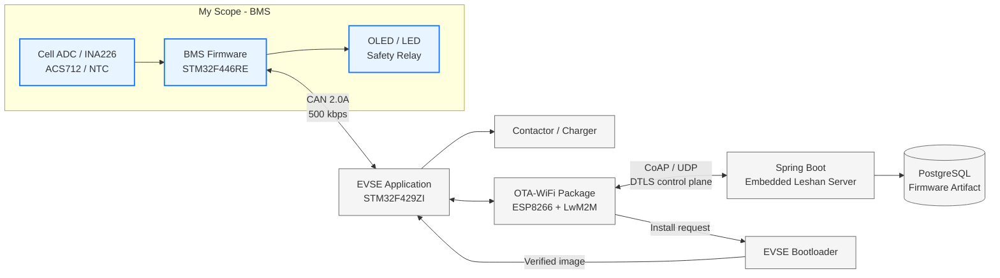
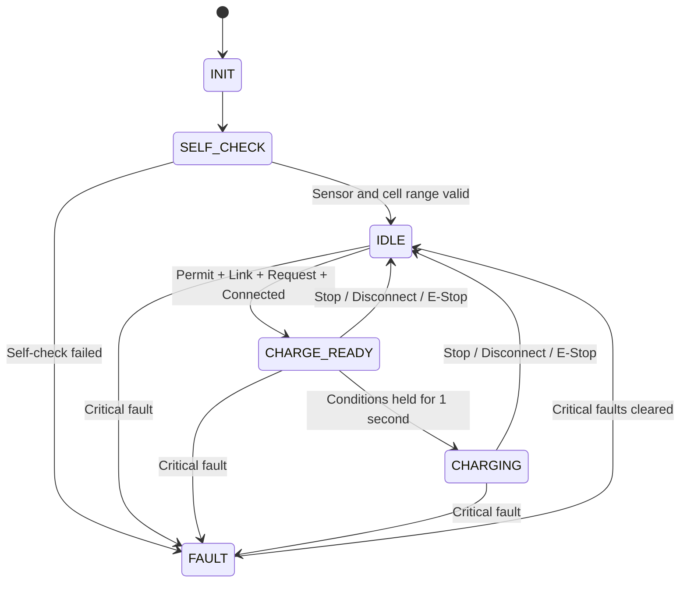

<div align="center">

# 🔋 Embedded Device Lifecycle Platform

### STM32 BMS · EVSE · LwM2M OTA 기반 임베디드 디바이스 생명주기 플랫폼

4S 배터리의 상태를 실시간으로 측정하고 안전한 충전 가능 여부를 판단한 뒤,<br>
CAN으로 EVSE와 연동하고 원격 펌웨어 업데이트까지 확장한 STM32 기반 통합 프로젝트입니다.

**담당 영역: BMS 펌웨어 전체 설계 · 구현 · 하드웨어 브링업 · 통합 검증**

</div>

---

## 📌 Project Overview

이 프로젝트는 배터리 상태를 수집하는 데서 끝나지 않고, **측정 → 보호 판단 → 충전 제어 연동 → 상태 표시 → 진단 → 펌웨어 업데이트**로 이어지는 임베디드 디바이스의 전체 운용 흐름을 구현하는 것을 목표로 합니다.

BMS는 STM32F446RE에서 4개 셀 전압, 팩 전류, 온도와 통신 상태를 감시합니다. 측정값으로 Fault와 SOC를 계산하고, 충전 허가 신호인 `charge_permit`와 BMS 측 직렬 릴레이를 안전 방향으로 제어합니다. EVSE와는 CAN 2.0A로 상태를 교환하며, 별도의 STM32F429ZI OTA 구성은 ESP8266·LwM2M·CoAP·Bootloader를 이용해 펌웨어 수명주기를 관리합니다.

> BMS는 감시·판단과 2차 차단을 담당합니다. 셀 단위 물리 보호는 별도 4S 보호보드가 수행하며, 충전 경로의 최종 제어 권한은 EVSE에 있습니다.

| 구성 | 대상 | 역할 | 실행 구조 |
| --- | --- | --- | --- |
| **BMS Firmware** | NUCLEO-F446RE | 4S 배터리 측정, Fault·SOC·FSM, 충전 허가, 직렬 릴레이, CAN | Bare-metal super-loop |
| **EVSE Application** | NUCLEO-F429ZI | 충전기 상태 제어, BMS CAN 연동, 최종 릴레이 제어 | FreeRTOS / CMSIS-RTOS2 |
| **OTA/Wi-Fi Package** | STM32F429ZI + ESP8266 | LwM2M `/5`, CoAP Block2 다운로드, Bank2 staging | CMSIS-RTOS2 package |
| **EVSE Bootloader** | STM32F429ZI | 이미지 검증, 설치, Application jump | Bare-metal |
| **OTA Platform** | Java / Embedded Linux | 장치 등록, DTLS-PSK, 펌웨어 상태·배포 API | Spring Boot + Leshan |

### 기술 스택

| 분류 | 기술 |
| --- | --- |
| MCU / Board | STM32F446RE, STM32F429ZI, NUCLEO-F446RE, NUCLEO-F429ZI |
| Firmware | C, STM32 HAL/CMSIS, FreeRTOS, CMSIS-RTOS2 |
| Build | CMake, Ninja, GNU Arm Embedded Toolchain |
| Device Network | CAN 2.0A 500 kbps, UART, I2C, ADC + DMA |
| OTA / Backend | ESP8266 AT, UDP, CoAP Block2, LwM2M 1.2, Wakaama, Leshan, DTLS-PSK |
| Server | Java 21, Spring Boot, PostgreSQL, Flyway |

---

## 📂 Contents

- [👨‍💻 My Contribution](#-my-contribution)
- [🧩 System Architecture](#-system-architecture)
- [⚙️ BMS Architecture](#️-bms-architecture)
- [🛡️ Safety Control](#️-safety-control)
- [📡 CAN Integration](#-can-integration)
- [🔌 Hardware Interface](#-hardware-interface)
- [🧪 Verification & Troubleshooting](#-verification--troubleshooting)
- [📊 Implementation Results](#-implementation-results)
- [🚀 Build & Run](#-build--run)
- [📁 Repository Guide](#-repository-guide)
- [⚠️ Known Limitations](#️-known-limitations)

---

## 👨‍💻 My Contribution

이 프로젝트에서 저는 **BMS 파트 전체를 담당**했습니다. STM32CubeMX 주변장치 설정부터 센서 드라이버, 주기 스케줄러, 보호 로직, SOC 추정, 상태 머신, CAN 프로토콜, OLED·LED·릴레이 제어, 진단 콘솔과 실보드 검증까지 BMS 펌웨어의 전 과정을 설계하고 구현했습니다.

| 담당 영역 | 직접 설계·구현한 내용 |
| --- | --- |
| **System Architecture** | `app → dev → hw → HAL` 단방향 4계층 구조, 공용 블랙보드, RTOS 없는 협조형 super-loop |
| **Voltage Sensing** | 4개 누적 셀 노드 ADC 측정, Vrefint 기반 VDDA 보정, 셀별 차분, 오버샘플링, 채널별 Q16 게인 캘리브레이션 |
| **Current / Temperature** | INA226 팩 전류·버스 전압, ACS712 교차 검증·포화 대체, NTC 4채널 최고 온도 감시 |
| **Safety Logic** | 8종 Fault 비트마스크, 3회 연속 확정, 히스테리시스, 해제 유지 시간, `charge_permit` fail-safe 제어 |
| **BMS FSM** | `INIT → SELF_CHECK → IDLE → CHARGE_READY → CHARGING → FAULT` 상태 전이와 진입 조건 설계 |
| **SOC Estimation** | 셀 평균 OCV 초기값, 1초 주기 쿨롱 카운팅, 무부하 IIR 재보정, 정수 고정소수점 연산 |
| **CAN Protocol** | BMS 송신 `0x100~0x105`, EVSE 수신 `0x200~0x205`, DLC·범위 검사, 링크 타임아웃, 파라미터 응답 |
| **Output / Diagnostics** | BMS 직렬 릴레이, 3색 상태 LED, SSD1306 OLED, USART2 명령 콘솔, POST·CAN·릴레이 트레이스 |
| **Hardware Bring-up** | ADC·I2C·CAN·UART·GPIO 단계별 활성화, 셀 캘리브레이션, I2C 복구, 실보드 2대 CAN 통합 검증 |

### 설계에서 중점적으로 해결한 부분

- 센서값을 곧바로 제어에 사용하지 않고 `bms_data_t` 블랙보드에 모아 판단 흐름을 단일화
- 한 번의 ADC 노이즈로 충전이 끊기지 않도록 Fault 진입 확정과 해제 히스테리시스를 분리
- Fault 판정, FSM 진입 동작, 릴레이 출력에서 중복으로 안전 조건을 확인하는 fail-safe 구조 적용
- INA226 션트 측정과 ACS712 홀 센서를 교차 검증하고, INA226 포화 시 대체 전류 경로 사용
- CAN의 “통신 정상”과 “충전 요청”을 서로 다른 조건으로 취급해 잘못된 충전 진입 방지
- 실제 계측값을 mV, mA, 0.1 °C 단위의 정수로 유지해 실행 시간과 코드 크기를 예측 가능하게 관리
- 콘솔 POST·원시값 덤프·프레임 트레이스로 배선, 센서, 프로토콜 문제를 단계적으로 구분

---

## 🧩 System Architecture



- 파란색 영역: 직접 담당한 BMS 하드웨어 인터페이스와 펌웨어
- 회색 영역: CAN 및 OTA로 연동되는 플랫폼 구성요소
- BMS와 EVSE는 서로 다른 MCU에서 동작하며, 소스가 아니라 CAN 프레임 규격만 공유합니다.
- 현재 BMS OTA는 지원하지 않습니다. BMS는 `0x203` OTA 진입 요청에 미지원 응답을 반환합니다.

### 전체 데이터 흐름

```text
Cell / Current / Temperature
            ↓
        Measurement
            ↓
      bms_data_t Blackboard
       ├─ Fault 판단 ───────→ charge_permit ─→ BMS Relay
       ├─ SOC 추정
       ├─ BMS FSM ──────────→ LED / OLED
       └─ CAN Packing ──────→ EVSE ─→ Charger / UI

EVSE Status / Charge Request / E-Stop
            └──────── CAN ───────────→ BMS FSM + Link Monitor
```

---

## ⚙️ BMS Architecture

📂 [`Embedded_Lifecycle_Device_BMS_Final/`](Embedded_Lifecycle_Device_BMS_Final/)

### 4계층 단방향 의존 구조

```text
Core/main.c
    └─ BMS/app      주기 스케줄러, 블랙보드, Fault, SOC, FSM, CAN, UI
         └─ BMS/dev 장치 드라이버: Cell ADC, INA226, ACS712, NTC, OLED, LED
              └─ BMS/hw  ADC, I2C, UART, GPIO, Tick, Debug HAL wrapper
                   └─ STM32 HAL / CMSIS
```

상위 계층은 하위 계층만 호출합니다. 애플리케이션 판단 코드가 HAL handle이나 레지스터를 직접 알지 않도록 분리해, 센서 교체와 하드웨어 디버깅이 보호 로직에 번지는 것을 줄였습니다.

전역 운용 상태는 [`bms_app.c`](Embedded_Lifecycle_Device_BMS_Final/BMS/app/bms_app.c)의 `static bms_data_t s_bms` 한 곳에만 존재합니다. `ap_collect()`가 장치 계층의 값을 수집하고 Fault·SOC·FSM·UI·CAN 모듈은 이 스냅샷을 읽습니다.

### 협조형 super-loop 스케줄

| 실행 주기 | 처리 내용 |
| --- | --- |
| 매 loop | CAN RX FIFO 폴링, UART 콘솔 입력 처리 |
| 100 ms | 센서값 수집 → Fault → FSM → 릴레이 → LED → CAN `0x100`, `0x103` |
| 500 ms | NTC 갱신, OLED 갱신, CAN `0x101`, `0x102` |
| 1,000 ms | SOC 적산, CAN `0x104`, CAN 통계, 상태 요약 로그 |

CAN RX는 인터럽트 알림 대신 main loop에서 FIFO를 계속 비웁니다. 주기 task에 RX를 묶지 않아 3단 FIFO가 100 ms 동안 쌓여 넘치는 상황을 방지했습니다.

### 센서 처리

| 측정 항목 | 처리 방식 |
| --- | --- |
| Cell 1~4 | B1/B2/B3/B+ 누적 노드를 ADC1 + DMA로 측정한 뒤 인접 노드를 차분 |
| VDDA | 내부 Vrefint factory calibration 값으로 실제 ADC 기준 전압 보정 |
| Pack Voltage | 셀 ADC의 B+ 누적 노드를 팩 전압 기준으로 사용 |
| Pack Current | INA226 션트 전류를 기본값으로 사용하고 포화 구간은 ACS712로 대체 |
| Temperature | NTC 4채널 가운데 유효한 채널의 최고 온도를 보호 판단에 사용 |
| SOC | 셀 평균 OCV로 초기화한 뒤 팩 전류를 1초마다 적산 |

SOC 내부값은 0.01% 해상도로 보관합니다. 전류 절댓값이 30 mA보다 크면 쿨롱 카운팅을 수행하고, 무부하에서는 OCV 값으로 천천히 수렴시켜 장기 오차를 보정합니다.

---

## 🛡️ Safety Control

### BMS 상태 머신



| 상태 | 의미 | BMS 릴레이 |
| --- | --- | --- |
| `INIT` | 주변장치 초기화 | OPEN |
| `SELF_CHECK` | 센서 준비 상태와 셀 전압 범위 확인 | OPEN |
| `IDLE` | 배터리 감시, EVSE 요청 대기 | OPEN |
| `CHARGE_READY` | 모든 충전 조건 만족, 출력 안정화 대기 | CLOSE |
| `CHARGING` | 충전 요청이 유지되는 상태 | CLOSE |
| `FAULT` | Critical Fault 발생, 충전 금지 | OPEN |

BMS 릴레이는 `charge_permit=1`이면서 상태가 `CHARGE_READY` 또는 `CHARGING`일 때만 닫힙니다. 릴레이 GPIO는 매 100 ms마다 다시 기록하므로 출력 latch가 노이즈로 흐트러져도 안전 지령으로 복귀합니다.

### Fault 정책

| Bit | Fault | 진입 기준 | 해제 기준 | 등급 |
| ---: | --- | --- | --- | --- |
| `0x01` | `CELL_OV` | 셀 > 4,200 mV | 모든 셀 < 4,150 mV | Critical |
| `0x02` | `CELL_UV` | 셀 < 3,000 mV | 모든 셀 > 3,100 mV | Critical |
| `0x04` | `PACK_OV` | 팩 > 16,800 mV | 팩 < 16,600 mV | Critical |
| `0x08` | `OVER_CURRENT` | `|I|` > 1,000 mA, Demo | `|I|` < 900 mA | Critical |
| `0x10` | `OVER_TEMP` | 최고 NTC > 55.0 °C | < 50.0 °C | Critical |
| `0x20` | `SENSOR_ERR` | 센서 미준비 또는 전류 센서 차이 > 500 mA | 센서 정상 / 대체 조건 | Critical |
| `0x40` | `LINK_TIMEOUT` | EVSE 유효 프레임 1초간 없음 | 정상 프레임 300 ms 유지 | Critical |
| `0x80` | `IMBALANCE` | 셀 편차 > 150 mV | 편차 ≤ 150 mV | Warning |

- Critical Fault는 기본적으로 100 ms 샘플 3회 연속 확인 후 확정합니다.
- 배터리·센서 Fault의 해제 조건은 3초간 유지되어야 하며, CAN 링크 복구는 300 ms를 사용합니다.
- `IMBALANCE`는 경고이므로 단독 발생 시 충전을 차단하지 않습니다.
- 상위 노드는 `fault == 0`이 아니라 반드시 `charge_permit`를 기준으로 충전 가능 여부를 판단합니다.
- Fault가 확정된 같은 100 ms slot 안에서 `charge_permit=0`, 릴레이 개방, CAN 상태 전송까지 처리합니다.

---

## 📡 CAN Integration

BMS와 EVSE의 유일한 결합 지점은 CAN 프레임 계약입니다.

| 항목 | 설정 |
| --- | --- |
| Protocol | CAN 2.0A, Standard 11-bit ID |
| Bitrate | 500 kbps |
| Timing | PCLK1 42 MHz / Prescaler 6 / BS1 11 TQ / BS2 2 TQ |
| Sample Point | 85.7% |
| Byte Order | Multi-byte Little Endian |
| Transceiver | SN65HVD230, 3.3 V |

### BMS → EVSE

| ID | 주기 | DLC | Payload |
| ---: | ---: | ---: | --- |
| `0x100` | 100 ms | 8 | Pack V 0.01 V, Pack I 0.01 A, SOC, Permit, State, Fault |
| `0x101` | 500 ms | 8 | Cell 1~4, 각 `int16` mV |
| `0x102` | 500 ms | 8 | 최고 온도 0.1 °C, 셀 편차, Cell Min, Cell Max |
| `0x103` | 100 ms | 2 | State, Fault 축약 프레임 |
| `0x104` | 1 s | 4 | Firmware Major, Minor, OTA/Reserved 현재 `0` |
| `0x105` | 응답 시 | 4 | 응답 코드, 상세 코드, 적용값 |

### EVSE → BMS

| ID | DLC | Payload / 처리 |
| ---: | ---: | --- |
| `0x200` | 4 | EVSE State, Relay, Connector, E-Stop; heartbeat 겸용 |
| `0x201` | 1 | 충전 중지/시작 요청 |
| `0x202` | 1 | EVSE Fault |
| `0x203` | 0 | BMS OTA 진입 요청; 현재 미지원 응답 |
| `0x205` | 4 | Parameter ID, `int16` 값, Magic `0xA5` |

EVSE 수신부는 DLC와 값 범위를 정확하게 검사하므로 프레임 길이·상태 enum·Fault bit를 바꾸면 양쪽 정의를 함께 수정해야 합니다. BMS는 부팅 시 CAN 클럭으로 실제 bitrate를 계산해 500 kbps와 1% 이상 차이나면 오류를 출력하고, 원격 프레임(RTR)은 양쪽 모두 폐기합니다.

### 실보드 연동

NUCLEO-F446RE BMS와 NUCLEO-F429ZI EVSE를 SN65HVD230으로 연결해 양방향 CAN 링크를 확인했습니다. BMS 콘솔의 프레임 trace와 `TEC/REC/LEC` 통계를 이용해 다음 순서로 문제를 구분했습니다.

```text
TX 증가 + TEC 0       → 상대 노드 ACK, 물리 계층 정상
TX 증가 + TEC 증가    → 상대 미기동 / bitrate / 종단 저항 확인
RX 0                  → 상대 송신 설정과 CAN enable 확인
BIT / STUFF Error      → 공통 GND, Rs 핀, CANH/CANL 배선 확인
```

---

## 🔌 Hardware Interface

### BMS Pin Map

| MCU Pin | Peripheral | 용도 |
| --- | --- | --- |
| PA0 / PA1 / PA4 / PB0 | ADC1 IN0 / IN1 / IN4 / IN8 | B1 / B2 / B3 / B+ 누적 셀 노드 |
| PC1 / PC0 / PC3 / PC4 | ADC1 IN11 / IN10 / IN13 / IN14 | NTC 1~4 |
| PC2 | ADC1 IN12 | ACS712-05B 전류 센서 |
| Internal CH17 | ADC1 Vrefint | VDDA 보정 |
| PB6 / PB7 | I2C1 SCL / SDA | INA226, 7-bit address `0x40` |
| PA8 / PC9 | I2C3 SCL / SDA | SSD1306 OLED, address `0x3C` |
| PB8 / PB9 | CAN1 RX / TX | SN65HVD230 |
| PA2 / PA3 | USART2 TX / RX | ST-Link VCP, 115200 8N1 |
| PA5 | GPIO Output | Power / Run LED |
| PC6 | GPIO Output | Charge / Relay LED |
| PC8 | GPIO Output | Fault LED |
| PB5 | GPIO Output | BMS 충전 차단 릴레이 |

### 연결 시 주의사항

- 셀 ADC는 각 누적 노드를 100 kΩ / 20 kΩ 분압기로 측정합니다. 배터리 연결 전에 분압비와 GND를 확인해야 합니다.
- INA226과 OLED는 각각 I2C1, I2C3에 분리되어 있습니다.
- SN65HVD230은 3.3 V로 구동하고 `Rs`는 GND에 연결합니다. 두 노드는 공통 GND가 필요합니다.
- CAN 양 끝에 120 Ω 종단을 사용합니다. 전원 OFF 상태에서 CANH–CANL이 약 60 Ω이면 정상입니다.
- `CFG_RELAY_ACTIVE_HIGH`가 실물 릴레이와 반대면 부팅 직후 접점이 닫힐 수 있습니다. 전력 연결 전에 무부하 상태에서 극성을 검증해야 합니다.
- ACS712는 PC2에 직접 연결되므로 어떤 상태에서도 ADC 입력이 VDDA를 넘지 않도록 해야 합니다.

---

## 🧪 Verification & Troubleshooting

### 진단 인터페이스

USART2를 115200 baud, 8-N-1로 열면 한 글자 명령을 즉시 처리합니다.

| 명령 | 기능 |
| --- | --- |
| `h` | 명령 목록과 릴레이·CAN 상태 |
| `s` | 부팅 POST 재실행 |
| `v` | ADC raw, 핀 전압, VDDA, 셀 노드, NTC dump |
| `k` / `d` / `x` | 셀 노드 보정 / 보정값 출력 / 초기화 |
| `c` | ACS712 무전류 offset 재보정 |
| `i` | INA226 재초기화와 즉시 측정 |
| `b` | I2C1·I2C3 bus recovery와 scan |
| `t` | CAN TX/RX frame trace toggle |
| `g` | 충전 진입 조건 snapshot |
| `l` | 상태 LED mute toggle |

### 문제 해결과 설계 결정

| 문제 | 원인 | 해결 |
| --- | --- | --- |
| 인접 셀 전압이 비정상적으로 커지거나 음수가 됨 | 누적 노드 한 채널의 실제 분압비 불일치가 차분 결과에 전파 | 채널별 분압 상수와 Q16 gain을 분리하고 ±25% calibration guard 적용 |
| INA226 전류가 약 ±819 mA에서 포화 | R100 0.1 Ω 션트의 측정 범위 한계 | 포화 flag를 검출하고 ACS712 전류로 대체, 두 센서 차이는 Fault로 감시 |
| 순간 노이즈로 Fault 진입 | 단일 ADC sample을 즉시 보호 판단에 사용 | 16회 ADC 평균, 3-sample Fault 확정, 진입·해제 임계값 분리 |
| CAN은 송신하지만 BMS가 `LINK_TIMEOUT` 진입 | 상대 CAN 비활성, bitrate·종단·GND·트랜시버 설정 문제 | 부팅 bitrate self-check, TEC/REC/LEC 통계, frame trace로 계층별 확인 |
| 릴레이 동작 순간 상태 해석이 어려움 | 측정·판단·출력·송신 로그의 시점 불일치 | 개폐 전후 ADC/CAN/Fault 변화를 남기는 relay window trace 추가 |
| I2C 장치가 부팅 후 응답하지 않음 | SDA stuck 또는 장치 초기화 실패 | bus recovery, address scan, 장치 재초기화 명령 제공 |
| CAN 연결은 살아 있지만 충전 상태로 가지 않음 | heartbeat와 charge request, connector, E-Stop 조건을 혼동 | `g` snapshot으로 각 조건을 분리 출력하고 FSM 진입 조건을 명시화 |

### 권장 검증 순서

1. 배터리와 충전 전원을 분리한 상태에서 GPIO 초기값과 릴레이 극성을 확인합니다.
2. 콘솔 `s`, `v`로 VDDA, ADC 포화, 누적 셀 노드 순서와 NTC 채널을 확인합니다.
3. 무전류 상태에서 `c`, `i`로 ACS712와 INA226의 영점·극성을 확인합니다.
4. OLED와 I2C 주소를 확인하고 필요하면 `b`로 두 bus를 복구·scan합니다.
5. 두 CAN 노드를 연결하고 `t`와 1초 통계로 TX/RX, TEC/REC, DLC를 확인합니다.
6. `g`로 충전 요청·커넥터·E-Stop·링크 조건을 확인한 뒤 무부하 릴레이 시험을 수행합니다.
7. 마지막으로 제한된 전압·전류 조건에서 Fault → Permit OFF → Relay OPEN 순서를 검증합니다.

---

## 📊 Implementation Results

| 항목 | 결과 |
| --- | --- |
| BMS Bring-up | `S1`, `S1B`, `S2~S8` 전체 활성화 |
| BMS Sensor Path | Cell ADC, INA226, ACS712, NTC 실측 경로 활성화 |
| Local I/O | SSD1306 OLED, 3색 LED, PB5 릴레이 활성화 |
| BMS Build | Debug clean build 완료, `.elf` / `.map` 생성 |
| FLASH | 59,576 B / 512 KiB, **11.36%** |
| RAM | 4,352 B / 128 KiB, **3.32%** |
| CAN Integration | F446RE BMS ↔ F429ZI EVSE 실보드 양방향 링크 확인 |
| OTA Reference | STM32F429ZI `0.1.0 → 0.2.0` LwM2M OTA E2E 검증 |

BMS 빌드 산출물은 다음 위치에 있습니다.

```text
Embedded_Lifecycle_Device_BMS_Final/build/Debug/
├── Embedded_Device_Lifecycle_BMS.elf
└── Embedded_Device_Lifecycle_BMS.map
```

OTA E2E 결과는 BMS 자체 업데이트가 아니라 STM32F429ZI EVSE reference 경로의 결과입니다. BMS OTA는 현재 명시적으로 미지원 상태입니다.

---

## 🚀 Build & Run

이 저장소는 여러 독립 target을 한곳에 모은 workspace입니다. 루트에는 통합 `CMakeLists.txt`가 없으므로 빌드할 프로젝트 디렉터리로 이동해야 합니다.

### BMS Build

요구 도구:

- CMake 3.22 이상
- Ninja
- GNU Arm Embedded Toolchain (`arm-none-eabi-gcc`)
- 선택: STM32CubeMX 또는 STM32 VS Code Extension

```powershell
cd Embedded_Lifecycle_Device_BMS_Final
cmake --preset Debug
cmake --build --preset Debug
```

Release build:

```powershell
cmake --preset Release
cmake --build --preset Release
```

생성된 `Embedded_Device_Lifecycle_BMS.elf`를 ST-Link와 STM32 지원 도구로 NUCLEO-F446RE에 program합니다.

### 기본 실행 순서

1. 셀 분압 회로, INA226, ACS712, NTC, OLED, CAN transceiver와 릴레이를 연결합니다.
2. 전력 경로를 분리한 상태에서 BMS firmware를 flash합니다.
3. ST-Link VCP를 115200 8-N-1로 열고 자동 POST 결과를 확인합니다.
4. `v`, `c`, `i`로 전압·전류 센서를 먼저 검증합니다.
5. EVSE CAN 노드를 연결하고 `t`를 켜 양방향 frame을 확인합니다.
6. `g`로 충전 진입 조건을 확인한 뒤 무부하 릴레이 시험을 수행합니다.
7. 모든 보호 동작을 확인한 후에만 제한된 전원 조건에서 통합 시험합니다.

> EVSE 없이 BMS 한 노드만 CAN에 연결하면 ACK를 제공할 상대가 없어 TEC가 증가하고 Bus-Off에 진입할 수 있습니다. 이는 단독 노드 시험에서 정상적인 CAN 동작입니다.

각 하위 프로젝트의 상세 빌드·실행 방법은 해당 문서를 참고하십시오.

- [BMS 상세 README](Embedded_Lifecycle_Device_BMS_Final/README.md)
- [EVSE Bootloader README](EVSE_BOOT-main/README.md)
- [OTA/Wi-Fi Package README](OTA-Package-stm32-main/README.md)
- [OTA Platform Architecture](ota-platform-main/ARCHITECTURE.md)
- [OTA Platform Development Status](ota-platform-main/DEVELOPMENT_STATUS.md)

---

## 📁 Repository Guide

```text
Final/
├── README.md
├── Embedded_Lifecycle_Device_BMS_Final/  # 직접 담당: BMS 전체 firmware
│   ├── BMS/
│   │   ├── app/                          # Scheduler, Fault, SOC, FSM, CAN, UI
│   │   ├── dev/                          # Cell ADC, INA226, ACS712, NTC, OLED, LED
│   │   ├── hw/                           # HAL wrapper: ADC, I2C, UART, GPIO, Tick
│   │   └── common/                       # Types, thresholds, pin/config, bring-up
│   ├── Core/                             # CubeMX entry and generated integration
│   ├── Drivers/                          # STM32 HAL / CMSIS
│   └── CMakeLists.txt
│
├── EVSE-Application-main/                # CAN protocol 대조용 EVSE snapshot
├── EVSE_BOOT-main/                       # UART 기반 EVSE Bootloader
├── OTA-Package-stm32-main/               # EVSE용 OTA/Wi-Fi add-on package
└── ota-platform-main/                    # LwM2M server, clients, OTA E2E reference
```

### BMS 핵심 파일

| 파일 | 역할 |
| --- | --- |
| [`bms_app.c`](Embedded_Lifecycle_Device_BMS_Final/BMS/app/bms_app.c) | 블랙보드, 주기 스케줄, 릴레이, 콘솔, POST |
| [`bms_fault.c`](Embedded_Lifecycle_Device_BMS_Final/BMS/app/bms_fault.c) | Fault 확정·해제·히스테리시스와 Permit 계산 |
| [`bms_state.c`](Embedded_Lifecycle_Device_BMS_Final/BMS/app/bms_state.c) | BMS 6-state FSM |
| [`bms_soc.c`](Embedded_Lifecycle_Device_BMS_Final/BMS/app/bms_soc.c) | OCV + 쿨롱 카운팅 SOC |
| [`bms_can.c`](Embedded_Lifecycle_Device_BMS_Final/BMS/app/bms_can.c) | CAN 송수신, filter, trace, 오류 통계 |
| [`bms_link.c`](Embedded_Lifecycle_Device_BMS_Final/BMS/app/bms_link.c) | CAN payload packing과 protocol dispatch |
| [`bms_cfg.h`](Embedded_Lifecycle_Device_BMS_Final/BMS/common/bms_cfg.h) | 임계값, 센서 상수, task 주기, CAN ID |
| [`bms_types.h`](Embedded_Lifecycle_Device_BMS_Final/BMS/common/bms_types.h) | 공용 상태·Fault·블랙보드 정의 |
| [`bringup.h`](Embedded_Lifecycle_Device_BMS_Final/BMS/common/bringup.h) | S1~S8 단계별 하드웨어 활성화 |

> `EVSE-Application-main/`은 BMS 담당자가 CAN 프레임 계약을 대조하기 위해 보관한 snapshot입니다. 실제 통합 보드에 사용한 최신 EVSE firmware는 EVSE 담당자의 별도 tree에서 관리됩니다. 이 폴더에서는 `can_protocol.h/.c`의 frame map과 validation을 기준으로 봅니다.

---

## ⚠️ Known Limitations

- 현재 BMS는 `CFG_DEMO_MODE=1`이며 과전류 기준 1 A, SOC 기준 용량 50 mAh입니다. 실제 배터리에 적용하기 전에 대상 팩 사양으로 반드시 변경해야 합니다.
- BMS 자체 OTA는 구현되어 있지 않으며 `0x203` 요청을 거부합니다.
- 셀 ADC calibration과 원격 과온 임계값은 RAM에만 유지되어 reset 후 기본값으로 돌아갑니다.
- INA226 모듈의 기본 R100 0.1 Ω shunt는 약 ±819 mA에서 포화됩니다. ACS712 대체 경로를 포함해 실제 범위와 극성을 검증해야 합니다.
- `IMBALANCE`는 경고만 제공하며 셀 balancing 회로를 직접 제어하지 않습니다.
- BMS 릴레이 상태와 개별 NTC 4채널 값은 현재 CAN payload에 포함되지 않습니다.
- 현재 검증은 실보드, UART log와 CAN trace 중심이며 host unit-test framework와 lint 설정은 포함되어 있지 않습니다.
- OTA reference의 CRC32는 전송 무결성 검사용이며 firmware signature, anti-rollback, 설치 중 전원 차단 rollback은 제품화 단계의 추가 항목입니다.

---

## 📄 License

STM32CubeMX 생성 코드와 HAL/CMSIS에는 STMicroelectronics의 각 라이선스가 적용되며, Wakaama 등 third-party 구성요소는 해당 디렉터리의 라이선스를 따릅니다. 프로젝트 사용자 코드의 배포 조건은 별도로 정해야 합니다.
